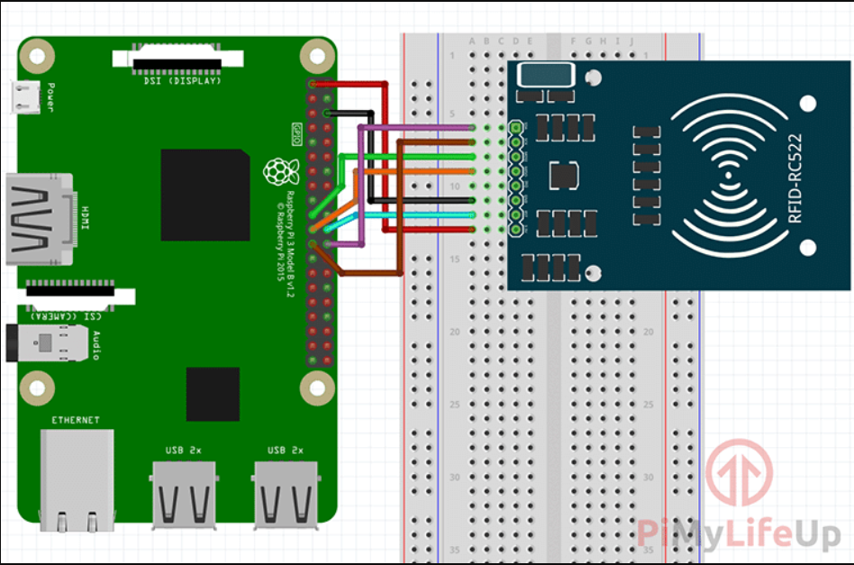

# RFID MFRC522 with Raspberry Pi

This project aims to interface an RFID MFRC522 reader with a Raspberry Pi to read and write RFID tags. The project includes basic instructions for setting up the environment, connecting the hardware, and running provided Python scripts to interact with the RFID reader.

## Environment Setup

1. **Install Required Libraries**: Install the necessary libraries by running the following command in your terminal:

   ```bash
   pip install -r requirements.txt
   ```

2. **Hardware Setup**: Connect the RFID MFRC522 reader to your Raspberry Pi according to the following pin connections:

   - SDA connects to Pin 24.
   - SCK connects to Pin 23.
   - MOSI connects to Pin 19.
   - MISO connects to Pin 21.
   - GND connects to Pin 6.
   - RST connects to Pin 22.
   - 3.3v connects to Pin 1.

   Refer to the images provided in the `connections` directory for visual guidance:
   
   

## Running the Scripts

Two Python scripts are provided:

1. **write.py**: This script writes data into the RFID card.
2. **read.py**: This script reads data from the RFID card.

To run these scripts:

1. Ensure the RFID reader is connected to the Raspberry Pi.
2. Open a terminal window.
3. Navigate to the directory containing the Python scripts.
4. Run the desired script by executing the following command:

   ```bash
   python write.py  # for write.py
   python read.py   # for read.py
   ```

Follow the prompts provided by the scripts to write or read data from the RFID tags.

## Note

- Make sure your Raspberry Pi has SPI enabled. You can enable SPI via `raspi-config`.
- Ensure that you have proper access rights to the GPIO pins, especially if you encounter permission errors.
- If you encounter any issues, refer to the troubleshooting section of the project documentation or seek help from the community.

Enjoy exploring RFID capabilities with your Raspberry Pi! If you have any questions or feedback, feel free to reach out.
